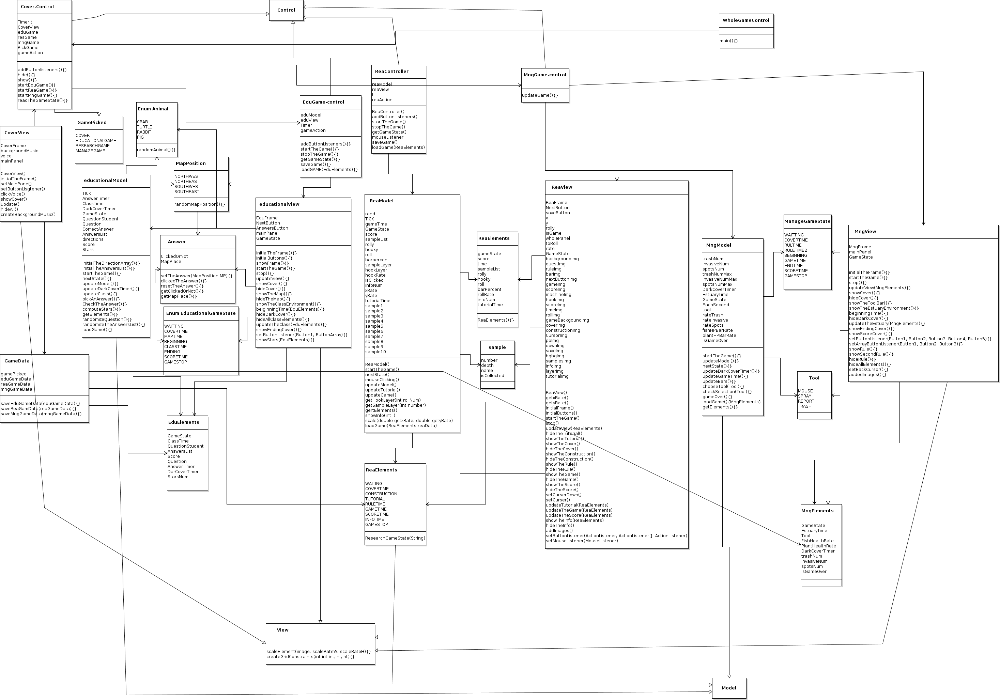

# Estuary Game (2018-11)
# Jiaxuan (Percy) Pan, Bozhan Hong, Zachary Mahl

This game project is designed for the DE estuary. The purpose of the game is education, and encourage low grade childrent to be interested in becoming a staff in the esutary management.

In the game:

Generally we will have three parts of games. The first frame in the game will show three different picture of characters including Educators, researchers and habitat managers.

If the player clicks the icon showing a teacher, they will go in the game "Estuary Classroom". Players will act as a teacher in a course to teach students about the locations of various animals in the estaury. The student randomly asks the locations of the particular animal, and in order to get the score, the player need to pick the right answers to answer the question.

After clicking the one showing a researcher. The player will go to a game called "Estuary Lab". By using mouse clicks to control the digging machine, player need to use machine to dig into the ground and stay at right place to get sand samples that are requested. After period of time, the screen will show the score they get and show informations about sand samples they collected.

If the player clicks the icon showing a steward, they will go in the game "Estuary Management". They will monitor the health of the animals within the estuary as well as the water itself. They will use the mouse to select the appropriate tool for each problem that occurs. After 60 seconds, or if the health of the estuary drops too low, the game will end with a congratulations or a try again screen. 

Game Vedio:

The whole program UML

